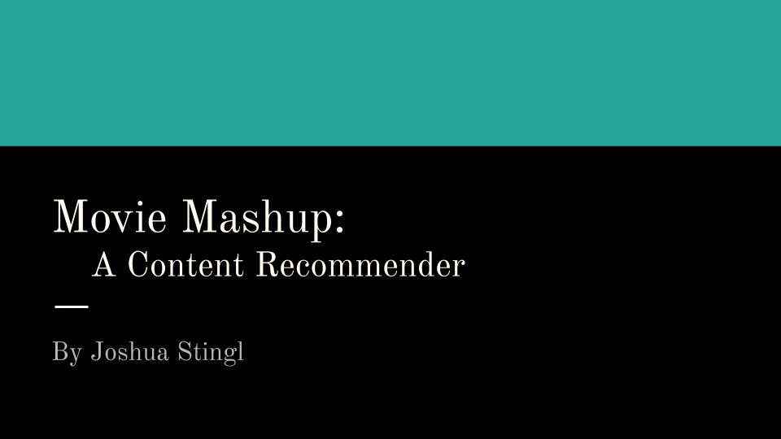
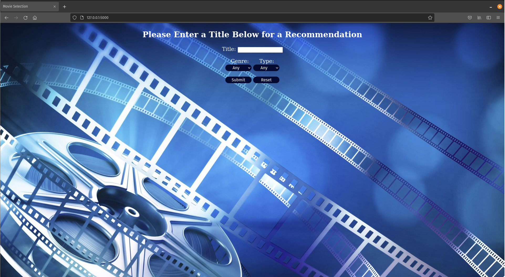
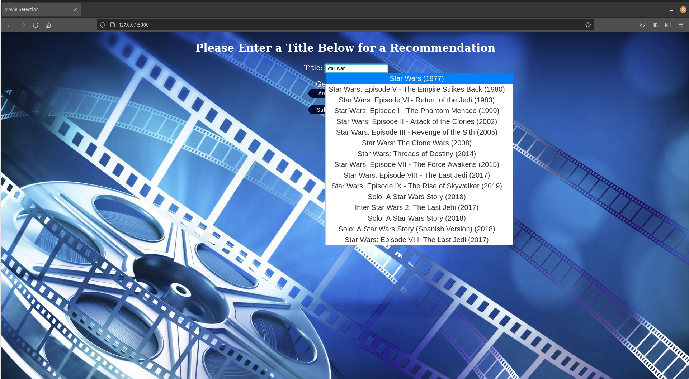
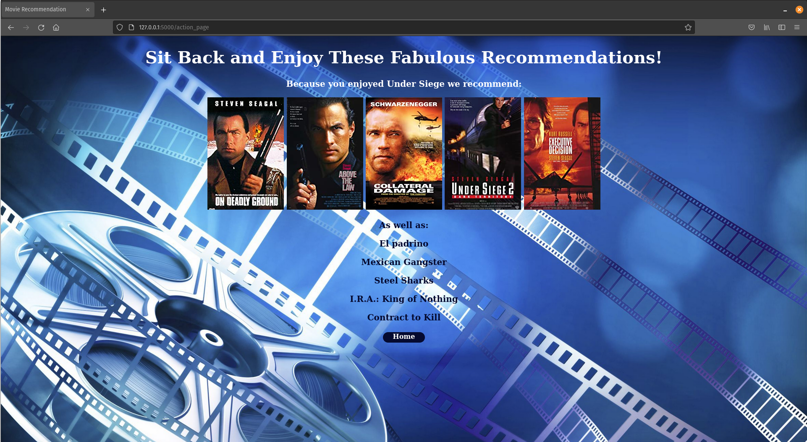

# Galvanize Data Science Immersive Capstone 3

### Content recommenders are all around us these days. From Amazon's recommendations on more items to explore or products related to the item you are currently working on and Netflix's suggestions for what to watch next because you watched a previous show. We can't forget the almost inevitable emails following an online purchase with ideas of what you may want to buy from the vendor next. Due to this I decided to focus my capstone on a content recommender with a Flask interface.

.png)

.png)

### I chose to make a movie and TV show recommender using two datasets from Kaggle,  IMDb and Netflix. With a third used for the Flask app.

.png)

Links for Kaggle Datasets used:

https://www.kaggle.com/shivamb/netflix-shows

https://www.kaggle.com/stefanoleone992/imdb-extensive-dataset

https://www.kaggle.com/neha1703/movie-genre-from-its-poster

.png)

.png)

.png)

.png)

.png)

.png)

